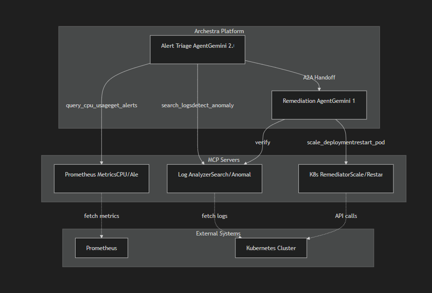

# 🤖 AgentPitCrew SRE Dashboard

An AI-driven Site Reliability Engineering (SRE) solution powered by **Archestra** and **Gemini**.
This project deploys a set of AI Agents that monitor Kubernetes clusters, triage alerts, and execute remediation actions autonomously (with human oversight).

## 🏗️ Architecture

The system consists of three main components:

1.  **Archestra Platform**: The orchestration engine hosting the AI agents.
2.  **MCP Servers**:
    - `prometheus-metrics`: Fetches metrics and alerts (Mock/Real).
    - `log-analyzer`: searches logs and detects anomalies.
    - `k8s-remediator`: Executes safe Kubernetes operations (Scale, Restart).
3.  **AI Agents**:
    - `AlertTriageAgent` (Gemini 2.0 Flash): Monitors and diagnoses issues.
    - `RemediationAgent` (Gemini 1.5 Pro): Fixes issues securely.



## 🚀 Quick Start (Local Deployment)

### Prerequisites
- Docker Desktop
- Windows PowerShell / Git Bash (Admin rights for setup)
- Google Gemini API Key

### 1. Start the Platform
Run the Archestra container with exposed ports for Kubernetes access:
```bash
docker run -d --name archestra-platform \
  -p 9000:9000 -p 3001:3000 -p 6443:6443 \
  -e ARCHESTRA_QUICKSTART=true \
  -v /var/run/docker.sock:/var/run/docker.sock \
  -v archestra-postgres-data:/var/lib/postgresql/data \
  -v archestra-app-data:/app/data \
  archestra/platform:latest
```
Access the dashboard at [http://localhost:3001](http://localhost:3001).

### 2. Configure Agents
1.  Go to **Settings** -> **LLM API Keys** -> Add your Gemini Key.
2.  Create `AlertTriageAgent` and `RemediationAgent` (see `archestra-config/agents/*.yaml` for prompts).
3.  Register MCP Servers (Images: `agentpitcrew/*:v1`).

### 3. Deploy SRE Dashboard (Kubernetes)
To deploy the dashboard application to the internal cluster:

1.  **Extract Kubeconfig:**
    ```bash
    docker exec archestra-platform kind get kubeconfig --name archestra-mcp > archestra-kubeconfig.yaml
    ```
    *Note: Ensure the server URL in `archestra-kubeconfig.yaml` points to `https://127.0.0.1:<PORT>` (check `docker port archestra-mcp-control-plane 6443/tcp`).*

2.  **Deploy via Helm:**
    ```bash
    export KUBECONFIG=$(pwd)/archestra-kubeconfig.yaml
    helm install sre-dashboard ./deployment/helm
    ```

3.  **Verify:**
    ```bash
    kubectl get pods
    ```

## 🧪 Usage

### Agent Chat
1.  Go to **New Chat** inside Archestra.
2.  Select **AlertTriageAgent**.
3.  Prompt: *"My app-1 has high CPU"*.
4.  Observe the agent checking metrics, logs, and diagnosing the issue.

### Audit Logs
To check who performed actions:
- Switch to **RemediationAgent** (or enable `k8s-remediator` on TriageAgent).
- Ask: *"Who scaled deployment db recently?"*

## 📁 Repository Structure
- `archestra-config/`: YAML definitions for Agents and MCP Servers.
- `mcp-servers/`: Source code for the 3 Python-based MCP servers.
- `deployment/helm/`: Helm charts for the SRE Dashboard.
- `deployment/docker/`: Docker Compose files (alternative setup).
